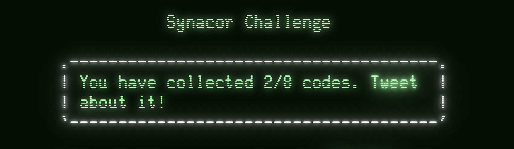
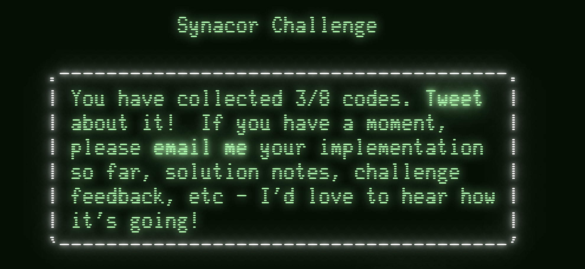
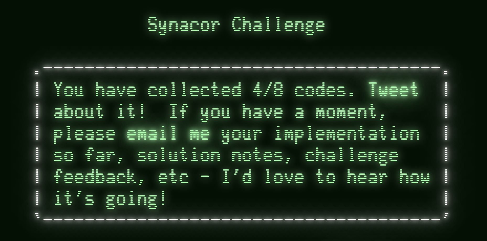
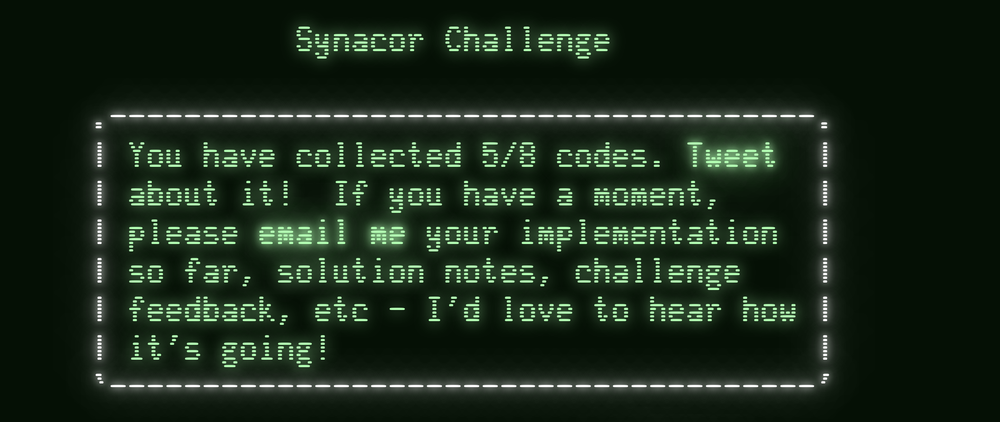
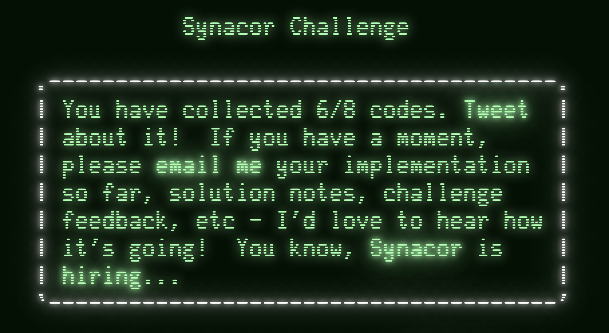

[](https://challenge.synacor.com/)

## Part 1

```text
Welcome to the Synacor Challenge!
Please record your progress by putting codes like
this one into the challenge website: "<SOME-CODE>"

Executing self-test...
```



## Part 2

```text
self-test complete, all tests pass
The self-test completion code is: "<SOME-CODE>"

== Foothills ==
You find yourself standing at the base of an enormous mountain.  At its base to the north, there is a massive doorway.  A sign nearby reads "Keep out!  Definitely no treasure within!"

Things of interest here:
- tablet

There are 2 exits:
- doorway
- south

What do you do?
```



## Code 4

```text
The tablet seems appropriate for use as a writing surface but is unfortunately blank.  Perhaps you should USE it as a writing surface...

What do you do?
use tablet


You find yourself writing "<SOME-CODE>" on the tablet.  Perhaps it's some kind of code?
```




## Code 5

Walking the maze

.... map!

```text
There are 4 exits:
- north
- south
- west
- east

What do you do?
north


Chiseled on the wall of one of the passageways, you see:

    "<SOME-CODE>"
```



## Part 6

```text
_ + _ * _^2 + _^3 - _ = 399
```

* red coin: 2
* corroded coin: 3
* shiny coin: 5
* concave coin: 7
* blue coin: 9

9 + 2 * 5^2 + 7^3 - 3 = 399

blue, red, shiny, concave, corroded

A previously locked door opens and we find a teleporter, which gives us the next code.

```text
You activate the teleporter!  As you spiral through time and space, you think you see a pattern in the stars...

    "<SOME-CODE>"
```



## Part 7

```text
The cover of this book subtly swirls with colors.
It is titled "A Brief Introduction to Interdimensional Physics".
It reads:

Recent advances in interdimensional physics have produced fascinating
predictions about the fundamentals of our universe!  For example,
interdimensional physics seems to predict that the universe is, at its root, a
purely mathematical construct, and that all events are caused by the
interactions between eight pockets of energy called "registers".
Furthermore, it seems that while the lower registers primarily control mundane
things like sound and light, the highest register (the so-called "eighth
register") is used to control interdimensional events such as teleportation.

A hypothetical such teleportation device would need to have have exactly two
destinations.  One destination would be used when the eighth register is at its
minimum energy level - this would be the default operation assuming the user
has no way to control the eighth register.  In this situation, the teleporter
should send the user to a preconfigured safe location as a default.

The second destination, however, is predicted to require a very specific
energy level in the eighth register.  The teleporter must take great care to
confirm that this energy level is exactly correct before teleporting its user!
If it is even slightly off, the user would (probably) arrive at the correct
location, but would briefly experience anomalies in the fabric of reality
itself - this is, of course, not recommended.  Any teleporter would need to test
the energy level in the eighth register and abort teleportation if it is not
exactly correct.

This required precision implies that the confirmation mechanism would be very
computationally expensive.  While this would likely not be an issue for large-
scale teleporters, a hypothetical hand-held teleporter would take billions of
years to compute the result and confirm that the eighth register is correct.

If you find yourself trapped in an alternate dimension with nothing but a
hand-held teleporter, you will need to extract the confirmation algorithm,
reimplement it on more powerful hardware, and optimize it.  This should, at the
very least, allow you to determine the value of the eighth register which would
have been accepted by the teleporter's confirmation mechanism.

Then, set the eighth register to this value, activate the teleporter, and
bypass the confirmation mechanism.  If the eighth register is set correctly, no
anomalies should be experienced, but beware - if it is set incorrectly, the
now-bypassed confirmation mechanism will not protect you!

Of course, since teleportation is impossible, this is all totally ridiculous.
```

Now?:
* Change eight register
* Print current instruction

```text
A strange, electronic voice is projected into your mind:

  "Unusual setting detected!  Starting confirmation process!  Estimated time to completion: 1 billion years."
```