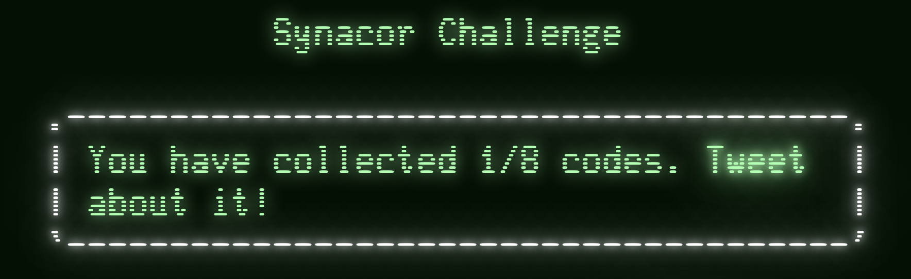
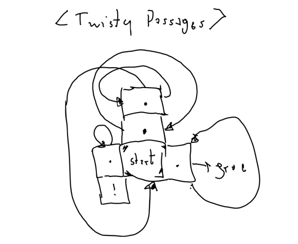
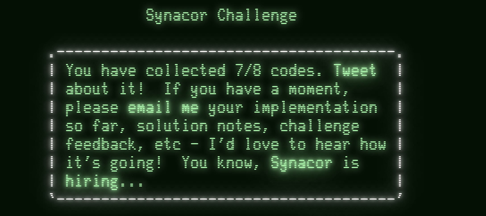
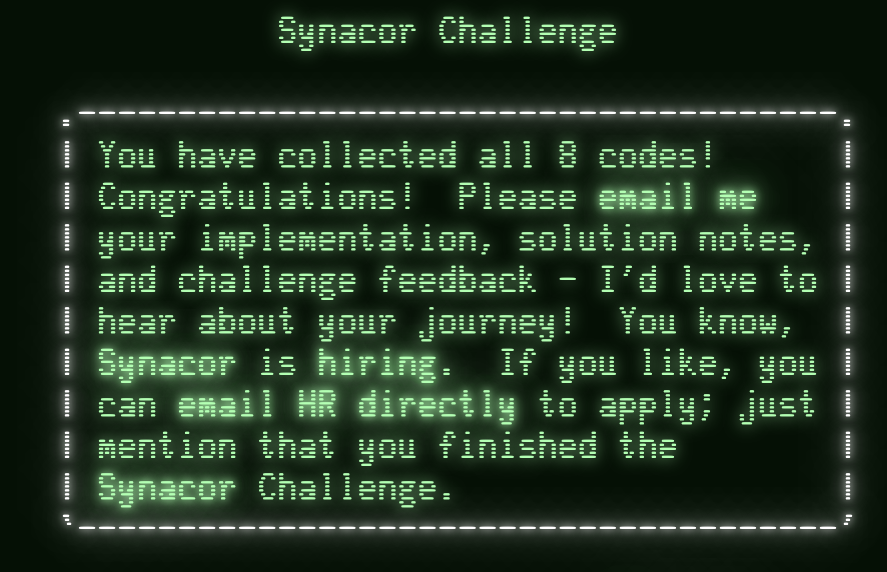

# The Synacor Challenge

The goal of this challenge is to collect **8 codes** that you can enter the [challenge website](https://challenge.synacor.com/)
to track your progress and prove that you have mastered the challenge. So let's go!

> **Spoiler Alert:** If you want to solve this challenge for yourself you should stop reading here.

## Code 1

The first code is basically for "showing up" at the challenge and it appears in the hints
section of the specification document (`arch-spec`).

```text
== hints ==
- Start with operations 0, 19, and 21.
- Here's a code for the challenge website: "<SOME-CODE>"
```



## Code 2

After reading this specification, the goal is clear. It's about implementing an interpreter
for a set of opcodes so a given input program (`challenge.bin`) can be executed. Experienced
Advent of Code competitors will experience a bit of a déjà vu here.

After implementing the first subset of opcodes, you get the next code.

```text
Welcome to the Synacor Challenge!
Please record your progress by putting codes like
this one into the challenge website: "<SOME-CODE>"

Executing self-test...
```


## Code 3

After implementing the full interpreter correctly, its runs a quick self-test and gives you
the third code.

```text
self-test complete, all tests pass
The self-test completion code is: "<SOME-CODE>"

== Foothills ==
You find yourself standing at the base of an enormous mountain.  At its base to the north, there is a massive doorway.  A sign nearby reads "Keep out!  Definitely no treasure within!"

Things of interest here:
- tablet

There are 2 exits:
- doorway
- south

What do you do?
```

The actual application that gets executed after that is a **text adventure** - how cool is that!

> **Note:** This text adventure prompts you for the next action (e.g. `go`, `take ...`, `look ...`).
> While this is fine for your first explorations, you want to have your input scripted and automatically replayed
> later. This saves you a lot of time!


## Code 4

You get the next code by executing a certain task in the text adventure.

```text
The tablet seems appropriate for use as a writing surface but is unfortunately blank.  Perhaps you should USE it as a writing surface...

What do you do?
use tablet

You find yourself writing "<SOME-CODE>" on the tablet.  Perhaps it's some kind of code?
```


## Code 5

When walking the maze, it helps to draw a map of it.



This way, it should not be a huge problem to find the right way and get the next code.

```text
There are 4 exits:
- north
- south
- west
- east

What do you do?
north


Chiseled on the wall of one of the passageways, you see:

    "<SOME-CODE>"
```


## Code 6

The next code is a little math puzzle. You find a couple of coins, each of them associated
with a numeric value. Then you need to arrange these coins in a way that solves
this equation.

The idea probably was to write a short program that tries all combinations. However, I was lazy/lucky
enough to find the solution by just squinting at the equation.

```text
_ + _ * _^2 + _^3 - _ = 399
```

* red coin: `2`
* corroded coin: `3`
* shiny coin: `5`
* concave coin: `7`
* blue coin: `9`

```text
9 + 2 * 5^2 + 7^3 - 3 = 399
```

A previously locked door opens and we find a teleporter, which gives us the next code.

```text
You activate the teleporter!  As you spiral through time and space, you think you see a pattern in the stars...

    "<SOME-CODE>"
```


## Code 7 😱

This puzzle was really tough and I actually had to look for help with this one.
The premise is that you have this teleporter and you need to tweak the program code
and interpreter a little to force teleportation to a new location.

```text
The cover of this book subtly swirls with colors.
It is titled "A Brief Introduction to Interdimensional Physics".
It reads:

Recent advances in interdimensional physics have produced fascinating
predictions about the fundamentals of our universe!  For example,
interdimensional physics seems to predict that the universe is, at its root, a
purely mathematical construct, and that all events are caused by the
interactions between eight pockets of energy called "registers".
Furthermore, it seems that while the lower registers primarily control mundane
things like sound and light, the highest register (the so-called "eighth
register") is used to control interdimensional events such as teleportation.

A hypothetical such teleportation device would need to have have exactly two
destinations.  One destination would be used when the eighth register is at its
minimum energy level - this would be the default operation assuming the user
has no way to control the eighth register.  In this situation, the teleporter
should send the user to a preconfigured safe location as a default.

The second destination, however, is predicted to require a very specific
energy level in the eighth register.  The teleporter must take great care to
confirm that this energy level is exactly correct before teleporting its user!
If it is even slightly off, the user would (probably) arrive at the correct
location, but would briefly experience anomalies in the fabric of reality
itself - this is, of course, not recommended.  Any teleporter would need to test
the energy level in the eighth register and abort teleportation if it is not
exactly correct.

This required precision implies that the confirmation mechanism would be very
computationally expensive.  While this would likely not be an issue for large-
scale teleporters, a hypothetical hand-held teleporter would take billions of
years to compute the result and confirm that the eighth register is correct.

If you find yourself trapped in an alternate dimension with nothing but a
hand-held teleporter, you will need to extract the confirmation algorithm,
reimplement it on more powerful hardware, and optimize it.  This should, at the
very least, allow you to determine the value of the eighth register which would
have been accepted by the teleporter's confirmation mechanism.

Then, set the eighth register to this value, activate the teleporter, and
bypass the confirmation mechanism.  If the eighth register is set correctly, no
anomalies should be experienced, but beware - if it is set incorrectly, the
now-bypassed confirmation mechanism will not protect you!

Of course, since teleportation is impossible, this is all totally ridiculous.
```

So what do we need to do?

* Change the 8th register to a *certain* value.
* Find out what that value is by reverse engineering and optimizing the confirmation mechanism.
* Disable/Skip the confirmation mechanism.

For that I added **disassembling** and tracing (printing current instruction, registers, ...)
functionality to the interpreter.

The first try, just changing the 8th register to value other than `0` immediately
lands us in the "promised" forever-running confirmation process.

```text
A strange, electronic voice is projected into your mind:

  "Unusual setting detected!  Starting confirmation process!  Estimated time to completion: 1 billion years."
```

So by simply patching the program code to skip the check, we can actually advance in the puzzle.

```cs
vm.Memory[5489] = 21; // nop
vm.Memory[5490] = 21; // nop
vm.Memory[5495] = 7; // jt
```

However, the get the **correct code**, we need to provide the **correct register** value.

```text
You wake up on a sandy beach with a slight headache.  The last thing you remember is activating that teleporter... but now you can't find it anywhere in your pack.  Someone seems to have drawn a message in the sand here:

    "<INCORRECT-CODE>"

It begins to rain.  The message washes away.  You take a deep breath and feel firmly grounded in reality as the effects of the teleportation wear off.
```

So it's back to reverse engineering the confirmation algorithm. By disassembling the code, I was
able to port it to C# but it still would run forever. I even though of adding **memoization**, but
it still was a tad to complex and ended up in a `StackoverflowException`.

That's the point where I ran out of ideas and had to Google for help. As it turned out
the underlying algorithm was a variation of the [Ackermann function](https://en.wikipedia.org/wiki/Ackermann_function)
(which I was unaware of or had forgotten about again). This simplified my solution enough that
the stack overflow would go away. Challenge solved!



## Code 8

The last puzzle is then a nice application of **bread-first-search**. You have a set
of numbers and arithmetic functions on floor tiles and need to find the shortest path
to a given result applying these operations.

You get detailed instructions in a journal that you pick up.

```text
Fireflies were using this dusty old journal as a resting spot until you scared them off.
It reads:

Day 1: We have reached what seems to be the final in a series of puzzles guarding an ancient treasure.
I suspect most adventurers give up long before this point, but we're so close!  We must press on!

Day 1: P.S.: It's a good thing the island is tropical.  We should have food for weeks!

Day 2: The vault appears to be sealed by a mysterious force - the door won't budge an inch.
We don't have the resources to blow it open, and I wouldn't risk damaging the contents even if we did.
We'll have to figure out the lock mechanism.

Day 3: The door to the vault has a number carved into it.
Each room leading up to the vault has more numbers or symbols embedded in mosaics in the floors.
We even found a strange glass orb in the antechamber on a pedestal itself labeled with a number.
What could they mean?

Day 5: We finally built up the courage to touch the strange orb in the antechamber.
It flashes colors as we carry it from room to room, and sometimes the symbols in the rooms flash colors as well.
It simply evaporates if we try to leave with it, but another appears on the pedestal in the antechamber shortly thereafter.
It also seems to do this even when we return with it to the antechamber from the other rooms.

Day 8: When the orb is carried to the vault door, the numbers on the door flash black, and then the orb evaporates.
Did we do something wrong?  Doesn't the door like us?  We also found a small hourglass near the door, endlessly running.
Is it waiting for something?

Day 13: Some of my crew swear the orb actually gets heaver or lighter as they walk around with it.
Is that even possible?
They say that if they walk through certain rooms repeatedly, they feel it getting lighter and lighter,
but it eventually just evaporates and a new one appears as usual.

Day 21: Now I can feel the orb changing weight as I walk around.
It depends on the area - the change is very subtle in some places, but certainly more noticeable in others,
especially when I walk into a room with a larger number or out of a room marked '*'.
Perhaps we can actually control the weight of this mysterious orb?

Day 34: One of the crewmembers was wandering the rooms today and claimed that the numbers on
the door flashed white as he approached!
He said the door still didn't open, but he noticed that the hourglass had run out and flashed black.
When we went to check on it, it was still running like it always does.
Perhaps he is going mad?
If not, which do we need to appease: the door or the hourglass?
Both?

Day 55: The fireflies are getting suspicious.
One of them looked at me funny today and then flew off.
I think I saw another one blinking a little faster than usual.
Or was it a little slower?
We are getting better at controlling the weight of the orb, and we think that's what the numbers are all about.
The orb starts at the weight labeled on the pedestal, and goes down as we leave a room marked '-',
up as we leave a room marked '+', and up even more as we leave a room marked '*'.
Entering rooms with larger numbers has a greater effect.

Day 89: Every once in a great while, one of the crewmembers has the same story: that the door flashes white,
the hourglass had already run out, it flashes black, and the orb evaporates.
Are we too slow?
We can't seem to find a way to make the orb's weight match what the door wants before the hourglass runs out.
If only we could find a shorter route through the rooms...

Day 144: We are abandoning the mission.  None of us can work out the solution to the puzzle.
I will leave this journal here to help future adventurers, though I am not sure what help it will give.
Good luck!

```

This gives you the final code, when you look in the mirror (make sure to **flip** the code).

```text
You gaze into the mirror, and you see yourself gazing back.
But wait!
It looks like someone wrote on your face while you were unconscious on the beach!
Through the mirror, you see "<SOME_CODE>" scrawled in charcoal on your forehead.

Congratulations; you have reached the end of the challenge!
```




